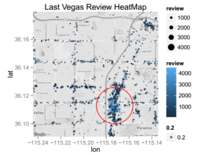
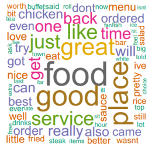
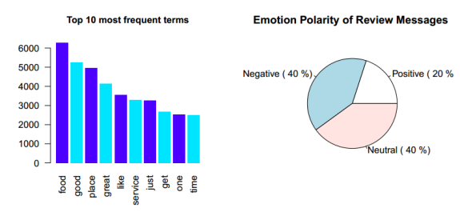
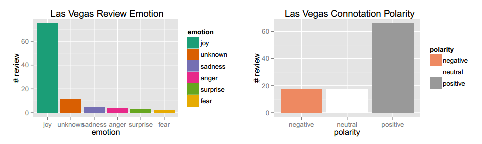

## Introduction

The evaluation is about the sentiment analysis over the review and stars rating restaurant in the Last Vegas city.. The YELP dataset is very resourceful which provides the valuation criteria over 61,184  unique records for `business` , 1,569,264 records for `review` and 495,107 records for the `tips`. Two tables have been discarded for now ,which is `user` details and the `check-in` information.The GPS longitude and latitude available inside the `business` dataset which provides very useful information about its geolocation. The star value gives the feedback from the customer which might be `positive` , `negative` or `neutral`.

<table width="0%" border="0">
  <tr>
    <td></td>
    <td></td>
  </tr>
</table>

--- .class #id 

## Methods and Data

The dataset is obtained from the YELP website . The format for the dataset is in `JSON` . JSON need special techniques to parse and read from it. Apache Hive is the best component which is capable read this format . Since the dataset required to have a good machine in term of CPU and memory , we push this dataset to work inside Hadoop which Map-Reduce can be used as the framework for the filtering and cleaning over large size of the dataset. For the basic analysis , this evaluation requires a fair amount time to know about the dataset abd performaing exploratory analysis. But, now we only focus on the textual information which mostly inside the `review` and `tips` dataset in conjuction with the `business` and `user` information. 

--- .class #id 

## Results

The results from the analysis we can summarize by plotting the `heatmap` of the message size inside the map of Las Vegas restaurant. We concluded that the message is more focus in the area of  `Fountains of Bellagio` along the `S Las Vegas Blvd` road. This road is the main highway in Las Vegas and there is a lot of casinos along it.The red area is the central area of the review messages. Major comments all over the year since 2004 is focused in that area. The location seems very strategic and it is only 2.5 miles from the `McCarran International Airport`. Most people will stay in this area and enjoyed the food before they have their flight or after they arrive here.

--- .class #id 

## Discussion

The issue of using such real data in this  situation raises several significant questions such as :- 

* How to determine the extent of limited demographic information, data frequency, the privacy concerns of Yelp users and harsh message that might be censored by YELP administration.
* Accessing and processing method due to increasingly for larger datasets. Some algorithm like Random Forest required high iteration and processing. 
* Assuring a sample's diversity by implementing feature selection and optimal ratio selection for training and testing dataset for prediction in the future.
* Authentication or validation of the reviewer's identity, to reduce or eliminate bias in the reviewer comments so all the information is genuinely entered and the analysis result can be trusted.

